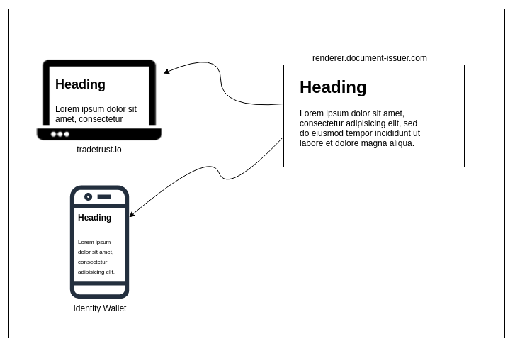
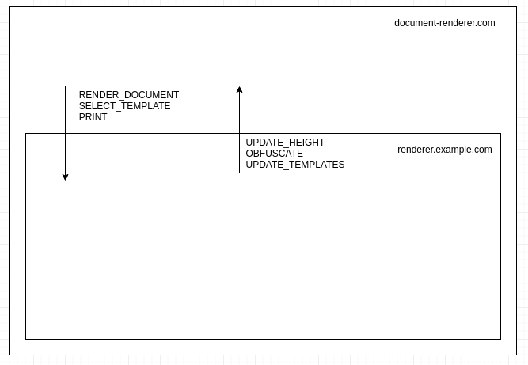

# Decentralised Document Rendering

## Status

Accepted

## Goal



The purpose of the decentralised document renderer is to allow OpenAttestation (OA) document issuers to style their documents without code change to the different implementations of the document viewer. It does so by embedding the website specified by the document issuers as an iframe or webview (for mobile apps) and sending the content of the OA document into the iframe.

## Frame-to-Frame Communication



Since the decentralised renderer is rendering a document dynamically, `Actions` are used to two-way communication between the parent frame (document-renderer.com) and the child frame (renderer.example.com).

All actions follow the same structure and are composed of type and payload

- `type` indicates the kind of action executed, for instance, RENDER_DOCUMENT to render a document. The type of action is mandatory
- `payload` indicates optional data associated with the type, for instance, the content of the document to render.

Examples of actions used:

```js
const renderDocumentAction = {
  type: "RENDER_DOCUMENT",
  payload: {
    document: documentToRender
  }
};

const printAction = {
  type: "PRINT"
};
```

### From host to frame actions

The following list of actions are made for the host to communicate to the iframe (and thus must be handled by application embed in the iframe):

#### RENDER_DOCUMENT

This action sends the document data to the child frame to be rendered.

The payload is an object with 2 properties:

- document: (mandatory) document data as returned by getData method from @govtechsg/open-attestation
- rawDocument: (optional) Open Attestation document

Example:

```js
const action = {
  type: "RENDER_DOCUMENT",
  payload: {
    document: getData(document),
    rawDocument: document
  }
};
```

#### SELECT_TEMPLATE

This action selects a template amongst the one provided by the decentralized renderer (A renderer may provide 1 to many different templates to display a document).

The payload is the tab id to display.

Example:

```js
const action = {
  type: "SELECT_TEMPLATE",
  payload: "CUSTOM_TEMPLATE"
};
```

#### PRINT

This action request for the template to process the print action by the browser.

Example:

```js
const action = {
type: "PRINT"
const action = {
  type: "PRINT"
};
```

#### GET_TEMPLATES

This action returns the list of template tabs available on the document.

The payload is the document data as returned by `getData` method from @govtechsg/open-attestation

Example:

```js
const action = {
  type: "GET_TEMPLATES",
  payload: getData(document)
};
```

## From frame to host actions

The following list of actions are made for iframe to communicate to the host (and thus must be handled by application embedding the iframe):

### UPDATE_HEIGHT

This action provides the full content height of the iframe so that the host can adapt the automatically the size of the embedded iframe.

The payload is the full content height of the child iframe.

Example:

```js
const action = {
  type: "UPDATE_HEIGHT",
  payload: 150
};
```

### OBFUSCATE

This action provides the name of a field on the document to obfuscate. The value must follow path property.

The payload is the path to the field to be obfuscated.

Example:

```js
const action = {
  type: "OBFUSCATE",
  payload: "a[0].b.c"
};
```

### UPDATE_TEMPLATES

This action provides the list of templates that can be used to render a document. This is usually the response to the `GET_TEMPLATES` action.

Example:

```js
const action = {
  type: "UPDATE_TEMPLATES",
  payload: [
    {
      id: "certificate",
      label: "Certificate"
    },
    {
      id: "transcript",
      label: "Transcript"
    }
  ]
};
```

## Implementations

[Decentralised Renderer Template](https://github.com/Open-Attestation/decentralized-renderer-react-template)

[Decentralised Renderer React Component](https://github.com/Open-Attestation/decentralized-renderer-react-components)
