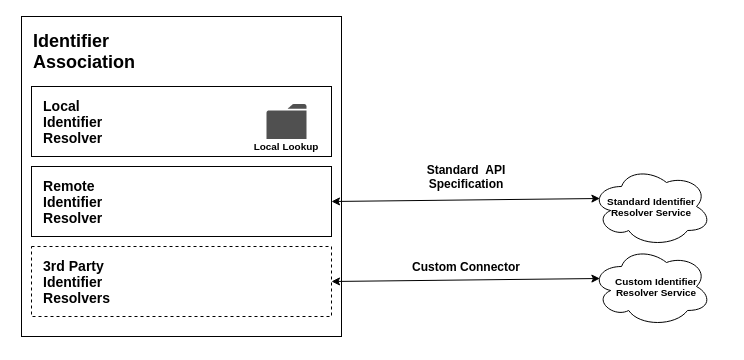

# Identifier Resolution Framework

## Status

Draft

## Goal

Ethereum addresses, DIDs and public keys are poor identifiers as they are cryptic, hard to remember and people are not used to seeing them. This ADR aim to address the question of "How might we resolve or associate identifiers with one another so that end users using the OpenAttestation framework has familiar identifiers like `ABC Pte Ltd`". This will happen in two places when end users interact with OA documents:

1. Issuer's Identity
2. Identifiers within the documents

Note that in the case of (1) Issuer's Identity, it requires an additional step to verify that the issuer **owns** the identifer.

In this case we can see the identity problem as two unique parts:

1. Identifier association (0x11..11 -> ABC Pte Ltd or did:sov:CYQLsccvwhMTowprMjGjQ6 -> XYZ Company)
2. Identifier ownership verification (document was issued by 0x11..11/abc.com/did:sov:CYQLsccvwhMTowprMjGjQ6)

This ADR focus only on (1) as (2) is covered under the [OpenAttestation Verifier](./verifier.md) ADR.

## Approach

To do this, we can leverage on different types of identifier resolvers. Examples of such resolvers are:

- Flat file to map one identifier to another
- 3rd Party REST APIS (conforming to our specs)
- 3rd Party Identity Resolution Modules

Counter examples to the resolvers are:

- DID Universal Resolver - github (ie did:github:gjgd -> pubKey(gjgd))
- DID Universal Resolver - sovrin (ie did:sov:CYQLsccvwhMTowprMjGjQ6 -> pubKey(CYQLsccvwhMTowprMjGjQ6))

In the counter examples, the resolver is trying to do the job of a verifier and it's also **moving away** from a more readable identifier.

### Data Structure

Given an identifier (ie 0x11..11), we will get the following response from the identifier association module:

```json
[
  {
    "id": "0x11...11",
    "type": "ETHEREUM_ADDRESS",
    "resolution": [
      {
        "id": "CommBank",
        "type": "COMPANY_NAME",
        "resolver": "LOCAL_IDENTIFIER_RESOLVER"
      }
    ]
  }
]
```

With this, we are now able to map `0x11...11` to `CommBank` on the interface and show that the resolution is from the `LOCAL_IDENTIFIER_RESOLVER` module.

### Modular Resolution



A modular approach is taken to resolve identifiers to more user-friendly ones. In this case, we provide two base modules for identifier resolver and allow 3rd party identifier resolvers to be added to the stack.

### Recursive Resolution

Data Structure for Modular Resolution

```json
[
  {
    "id": "0x11...11",
    "type": "ETHEREUM_ADDRESS",
    "resolution": [
      {
        "id": "CTBAAU2S",
        "type": "SWIFT_BIC",
        "resolver": "3RD_PARTY_IDENTIFIER_RESOLVER"
      }
    ]
  },
  {
    "id": "CTBAAU2S",
    "type": "SWIFT_BIC",
    "resolution": [
      {
        "id": "CommBank",
        "type": "COMPANY_NAME",
        "resolver": "LOCAL_IDENTIFIER_RESOLVER"
      },
      {
        "id": "COMMBANK",
        "type": "COMPANY_NAME",
        "resolver": "3RD_PARTY_IDENTIFIER_RESOLVER"
      }
    ]
  }
]
```

With this, we are now able to map `0x11...11` to `CTBAAU2S` and then to `CommBank` on the interface and show that the resolution is from the `3RD_PARTY_IDENTIFIER_RESOLVER` in the first leg and `LOCAL_IDENTIFIER_RESOLVER` in the second leg.

## Risks

Since the documents are rendered from external iframe, it is unlikely we are able to force identifiers to change or provide an information overlay.

Identifying identifiers. Given a document with references to an identifier ie (0x1111) how should we highligt all these identifiers, considering that there are numerous identifiers with different patterns?

Two way binded identifier might mess around with the resolution chain.

## Implementation

### Browser Plugin

### Verifier and Renderer Add-ons

#### Option 1 - Identifier resolving on verifier

Parent to Child: Available identifiers which can be resolved (ie did:sov:CYQLsccvwhMTowprMjGjQ6, 0x1111..1111)
Child to Parent: Display resolution for this identifier (ie 0x1111..1111)

#### Option 2 - Identifier resolving on renderer
