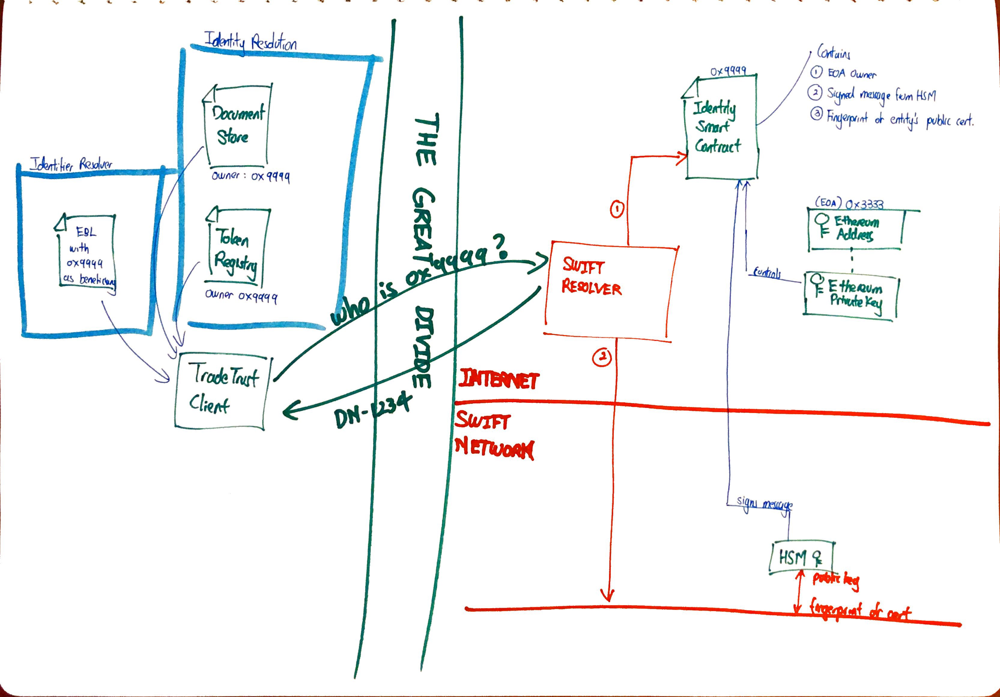

# Identifier Resolver Integration

## Status

Draft

## Goal

To design how can a 3rd party private network can project it's private identity infrastructure such as a PKI into the blockchain space to work with TradeTrust. In this example, we will be looking at how might SWIFT be able to interact with the TradeTrust.

In this ADR, we aim to explore how might SWIFT be able to provide a component for [identifier resolution](./identifier_resolution_framework.md) which will adopt similar interface to our [identifier resolution POC](./identifier_resolution_pod.md).

In simple terms, when a TradeTrust user's ask a question "Who is 0x9999", the SWIFT identifier resolution API will simply respond with "0x9999 is DN: bankbebb", where DN: bankbebb can be immediately recognized by the user immediately.

Once the identifier resolution is achieved, we can consider using similar method to resolve the identity of a document creator within our [document verification framework](./generalised_verification_method.md), if and only if the entire verification process can be performed by an user who is outside of the SWIFT network independently.

## Architectural Principles

| Principle                    | Rationale                                                                                                                      |
| ---------------------------- | ------------------------------------------------------------------------------------------------------------------------------ |
| Separation of Concerns       | Different components in the entire ecosystem should have clear roles and interfaces.                                           |
| Loose Coupling of Components | Each component should be loosely coupled to other components so that they can be reused for other purposes or systems as well. |

## Overall Architecture

## Stakeholders

To begin, we identify the key stakeholder in this ecosystem.

1. `User A` who is a person verifying an eBL on TradeTrust website.
2. `Bank B` who is the beneficiary of the said eBL whose identity if backed by SWIFT PKI.
3. `SWIFT` who is operating the infrastructure for identifier resolution using SWIFT's PKI

## Key Components

1. `TradeTrust Website` which is a static website which identifier resolvers can be configured to use the SWIFT identifier resolver.
1. `SWIFT API` which is an API that resides in the internet zone to allow anyone to resolve a given ethereum address. In this example, we will use `demo-address-resolver.swift.com`
1. Bank B's `Identifier` which is what Bank B is known as within the SWIFT network. In the example, the bank is identified by it's [DN](https://developer.swift.com/glossary/distinguished-name-dn) `bankbebb`
1. Bank B's `Ethereum Wallet` which is a private-public key pair that is used to sign transactions. In the example, it has the wallet address `0x3333`
1. Bank B's `Identity Smart Contract` which is a smart contract that acts as a wallet controlled by Bank B's `Ethereum Wallet`. In this example, it has the wallet address `0x9999`
1. Bank B's `Certificate / Public Key` which resides in SWIFT network and is not exposed on the internet.
1. Bank B's `Fingerprint of the Certificate` which is a unique identifier used to look up the `Certificate / Public Key` within the SWIFT network.
1. Bank B's `Signed challenge request` which is signed with the `HSM` and can be verified with the `Certificate / Public Key`. This is stored on `Identity Smart Contract`. The message signed is the smart contract address to prevent replay attack by other smart contracts.
1. Bank B's `HSM` which is used to sign arbitrary challenge strings.

## End User Flow

We will begin with the end in mind and observe what happens when a user, external to SWIFT network, is able to resolve `0x9999` which is the beneficiary on an eBL to the identifier `bankbebb`.

### Process

1. User A will drop the eBL into TradeTrust Website which will resolve the beneficiary of the eBL to `0x9999`.
1. The website will make a call to `demo-address-resolver.swift.com` to quest for the identifier for `0x9999`.
1. Upon recieving the request for identifier of `0x9999`, the `SWIFT API` will look up that address on Ethereum to check if it's an instance of an `Identity Smart Contract`.
1. If it is, `SWIFT API` will grabs the `Fingerprint of the Certificate` and the `Signed challenge request`.
1. `SWIFT API` will verify that the `Signed challenge request`'s message is the smart contract address itself to prevent replay attacks.
1. `SWIFT API` will then fetch the `Certificate / Public Key` of Bank B using the `Fingerprint of the certificate`. This will also yield Bank B's identifier which is the DN `bankbebb`.
1. `SWIFT API` will then verify the signature of the `Signed challenge request` with the `Certificate / Public Key` of Bank B.
1. Upon all the checks above `SWIFT API` will respond to User A that the identifier `0x9999` has been resolved to DN `bankbebb`.
1. Upon receiving the above response, TradeTrust website will append the info `bankbebb` as the beneficiary of the eBL

## The Setup

For the above process to be possible, there needs to be a few key component to be built and setup by different parties on top of current implementation.

### For Bank B

1. Generate a `Ethereum wallet` which has both the private key and the address (0x3333)
1. Deploy an instance of a `Identity Smart Contract`. Technical details are covered in sections below.

### For SWIFT

1. Set up the `API` as per the process which allows for anyone to send the query.

## Technical Details

### Identity Smart Contract

The `Identity Smart Contract` is key to how we can project an identity out from a private PKI.

It needs to:

1. Be identifiable by a Ethereum address (ie `0x9999`)
1. Be controlled by an externally owned account (EOA) (ie `0x3333`)
1. Be able to act as a proxy to an EOA to perform smart contract execution
1. Be able to store the signed challenge request
1. Be able to store the fingerprint of the certificate

For it's standards, we can reference [ERC725](https://erc725alliance.org/) for the identity standards.

For it's implementation we can reference the implementations for several proxy contracts that allows for delegate contract calls. Examples are multisig wallets and proxy contracts.

One great implementation of such contract is the [Kitsune Wallet](https://github.com/Amxx/KitsuneWallet-ERC1836) which is both a wallet (fulfils 1-3) and can be implemented with a logic (fulfils 4-5).
