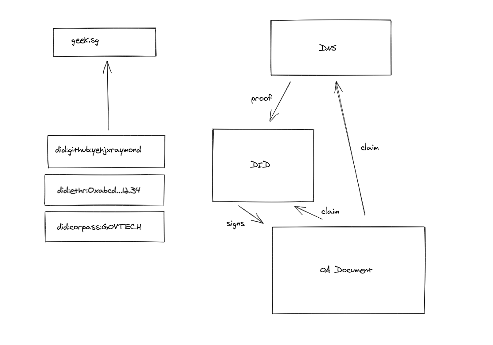
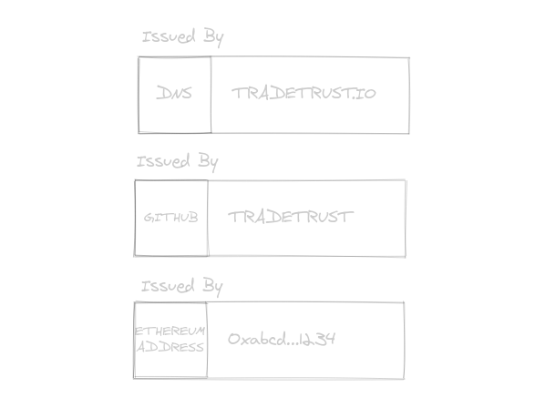

###### Authors:

Raymond Yeh

# Identify Issuer & Issuing Document using DID

## Goal

As a new issuer, I would like to issue verifiable documents without using ethers to reduce cost, but yet being able to be identified via DNS or DID.
As an existing issuer of verifiable document and transferable records, I would like to have my identity bound to a DID instead of DNS only.

The problems describe above have two facet:

1. How might we identify issuers of document via DID, especially if they are using issuing transferable records?
2. How might an issuer who is identified with DID be able to issue verifiable document directly by signing on it?
3. How might we revoke a document issued directly with DID?

## Background

There were request to the team for issuers to be able to sign on a document directly using an Ethereum private key directly. The original solution was include a new proving method to allow issuers to use a key to sign on the document [[1]](https://github.com/Open-Attestation/oa-verify/pull/91). There were suggestions as part of the original discussion which propose how might one be able to associate the unknown key to a DNS by inserting a DNS record to bind the relationship [[2]](https://github.com/Open-Attestation/adr/pull/22).

## Approach

This document revisits the entire discussion to form an understanding of the guiding principles which leads to implementation detail at the end.

## Guiding Principles

1. The solution should be guided by W3C VC standards as far as possible
2. The solution should allow a less expensive way to issue verifiable document
3. The solution should allow revocation of said document
4. The solution should extend to DID
5. The solution should leverage on the scale of DID for maximum reach

## Overview



The proposed solution is to allow DID's to be used a terminal identifier in OA viewers.



The approach will extend the current approach of using only DNS as the terminal identifier and also allow for DID's. While certain identifiers such as ethereum addresses may not be human-friendly, they are still useful for machines which are able to process them. This allows anyone with DID to be able to associate it with their issued documents.

Optionally, one may also associate their DID with a domain name to allow both the DID and the domain name to be recognized as the issuer.

## Technical Details

For simplicity sake, we will use a DID document from the universal resolver as shown in the implementation details discussed:

```json
{
  "@context": "https://w3id.org/did/v1",
  "id": "did:ethr:0xE6Fe788d8ca214A080b0f6aC7F48480b2AEfa9a6",
  "authentication": [
    {
      "type": "Secp256k1SignatureAuthentication2018",
      "publicKey": ["did:ethr:0xE6Fe788d8ca214A080b0f6aC7F48480b2AEfa9a6#owner"]
    }
  ],
  "publicKey": [
    {
      "id": "did:ethr:0xE6Fe788d8ca214A080b0f6aC7F48480b2AEfa9a6#owner",
      "type": "Secp256k1VerificationKey2018",
      "ethereumAddress": "0xe6fe788d8ca214a080b0f6ac7f48480b2aefa9a6",
      "owner": "did:ethr:0xE6Fe788d8ca214A080b0f6aC7F48480b2AEfa9a6"
    },
    {
      "id": "did:ethr:0xE6Fe788d8ca214A080b0f6aC7F48480b2AEfa9a6#delegate-1",
      "type": "Secp256k1VerificationKey2018",
      "owner": "did:ethr:0xE6Fe788d8ca214A080b0f6aC7F48480b2AEfa9a6",
      "publicKeyHex": "0295dda1dca7f80e308ef60155ddeac00e46b797fd40ef407f422e88d2467a27eb"
    }
  ]
}
```

### For documents that are signed directly

Assuming that an issuer with DID has the private key to one of the public key in the DID document, we can simply signal the intent to issue a given document by signing the `merkleRoot` of the document itself.

The issuer will simple append this proof into the root level of the document as such. The proof structure resembles the existing proof block in [w3c vc's structure](https://www.w3.org/TR/vc-data-model/#proofs-signatures).

Also, to signal if the document may or may not be revoked, a compulsory key `revocation.type` must always be present. It may take on multiple types of values such as:

- `NONE`
- `REVOCATION_STORE`
- `SIMPLE_REVOCATION_LIST`
- `REVOCATION_ENDPOINT`
- etc

A `revocation.type: "NONE"` must exist to ensure that the an end user did not obfuscate the revocation information to prevent his document from being revoked.

```json
{
  "schema": "tradetrust/v1.0",
  "data": {
    "issuers": [
      {
        "name": "TradeTrust Demo",
        "did": {
          "id": "did:ethr:0xE6Fe788d8ca214A080b0f6aC7F48480b2AEfa9a6",
          "purpose": "DOCUMENT_ISSUANCE",
          "revocation": {
            "type": "REVOCATION_STORE",
            "address": "0xabcd...1234"
          },
          "key": {
            "id": "did:ethr:0xE6Fe788d8ca214A080b0f6aC7F48480b2AEfa9a6#owner",
            "type": "Secp256k1VerificationKey2018",
            "ethereumAddress": "0xe6fe788d8ca214a080b0f6ac7f48480b2aefa9a6",
            "owner": "did:ethr:0xE6Fe788d8ca214A080b0f6aC7F48480b2AEfa9a6"
          }
        },
        "identityProof": {
          "type": "DNS-TXT",
          "location": "example.com"
        }
      }
    ]
  },
  "proof": {
    "type": "DidGenericSignature",
    "proofPurpose": "assertionMethod",
    "signature": "<signed merkle root>"
  }
}
```

### For documents issued through document store or token registry

```json
{
  "schema": "tradetrust/v1.0",
  "data": {
    "issuers": [
      {
        "name": "TradeTrust Demo",
        "documentStore": "0x6d71da10Ae0e5B73d0565E2De46741231Eb247C7",
        "did": {
          "id": "did:ethr:0xE6Fe788d8ca214A080b0f6aC7F48480b2AEfa9a6",
          "purpose": "CONTRACT_ADDRESS_PROOF",
          "signature": "xxxx",
          "key": {
            "id": "did:ethr:0xE6Fe788d8ca214A080b0f6aC7F48480b2AEfa9a6#owner",
            "type": "Secp256k1VerificationKey2018",
            "ethereumAddress": "0xe6fe788d8ca214a080b0f6ac7f48480b2aefa9a6",
            "owner": "did:ethr:0xE6Fe788d8ca214A080b0f6aC7F48480b2AEfa9a6"
          }
        },
        "identityProof": {
          "type": "DNS-TXT",
          "location": "example.com"
        }
      }
    ]
  },
  "privacy": {
    "obfuscatedData": []
  },
  "signature": {
    "type": "SHA3MerkleProof",
    "targetHash": "61dc9186345e05cc2ae53dc72af880a3b66e2fa7983feaa6254d1518540de50a",
    "proof": [],
    "merkleRoot": "61dc9186345e05cc2ae53dc72af880a3b66e2fa7983feaa6254d1518540de50a"
  }
}
```

- Note that in this case, we have replaced the `DNS-TXT` record with a proof that the document store address can be associated with the DID

## Implementation Details

TBD

## Non-breaking Upgrade

TBD

### Difference with existing PR

[#91](https://github.com/Open-Attestation/oa-verify/pull/91)
Instead of supporting a single signing method directly, the suggested approach is to support all the DID signing methods eventually, starting with did:ethr signing method. In addition, the specific public key used to sign the document is kept in the document to allow fo easy searching of matching key from the resolver.

[#93](https://github.com/Open-Attestation/oa-verify/pull/93)
Instead of allowing a custom mix and match, the suggested approach is to bundle both document store issue and revoke method into one, and that one should not run without the other. This prevents an ambiguous case where there is both document store and direct signing proof. This is dangerous when the signing key has not been bound to an identity.

[#80](https://github.com/Open-Attestation/oa-verify/pull/80)
Instead of querying the blockchain for the presence of a transaction and the tx.origin of that transaction, we avoid the use of transaction in the first place. In addition, tx.origin is not a common approach for attesting identity as it prevents further abstraction of identity through identity proxies like DSProxy or multisig wallets. The suggested approach is to directly embed the signed message from a key associated with the DID within the document. This way:

- no transactions is needed on the ethereum network
- we know that the DID

## Extension

### Counterfactually deploying document store as revocation store

This allow a user to "reserve" an address for the revocation store in the future but not perform the action now. The user will still be able to use the address during the document creation phase.

### Additional Notes

- I noticed that we may move the "DNS-TXT" out of the data object for existing OA document as well without affecting the security of it
- How do we allow a document to use both DID and DNS proof?

### Notes 11/08/20

Directly signed with DID with DNS binding

```json
{
  "schema": "tradetrust/v1.0",
  "data": {
    "issuers": [
      {
        "name": "TradeTrust Demo",
        "identityProof": [
          {
            "type": "DID",
            "id": "did:ethr:0xE6Fe788d8ca214A080b0f6aC7F48480b2AEfa9a6",
            "purpose": "DOCUMENT_ISSUANCE",
            "revocation": {
              "type": "REVOCATION_STORE",
              "address": "0xabcd...1234"
            },
            "key": {
              "id": "did:ethr:0xE6Fe788d8ca214A080b0f6aC7F48480b2AEfa9a6#owner",
              "type": "Secp256k1VerificationKey2018",
              "ethereumAddress": "0xe6fe788d8ca214a080b0f6ac7f48480b2aefa9a6",
              "owner": "did:ethr:0xE6Fe788d8ca214A080b0f6aC7F48480b2AEfa9a6"
            }
          },
          {
            "type": "DNS-DID",
            "location": "example.com"
          }
        ]
      }
    ]
  },
  "proof": {
    "type": "DidGenericSignature",
    "proofPurpose": "assertionMethod",
    "signature": "<signed merkle root>"
  }
}
```

Issued via Document Store, identified via DNS through DID

```json
{
  "schema": "tradetrust/v1.0",
  "data": {
    "issuers": [
      {
        "name": "TradeTrust Demo",
        "documentStore": "0x6d71da10Ae0e5B73d0565E2De46741231Eb247C7",
        "identityProof": [
          {
            "type": "DID",
            "id": "did:ethr:0xE6Fe788d8ca214A080b0f6aC7F48480b2AEfa9a6",
            "purpose": "CONTRACT_ADDRESS_PROOF",
            "signature": "",
            "key": {
              "id": "did:ethr:0xE6Fe788d8ca214A080b0f6aC7F48480b2AEfa9a6#owner",
              "type": "Secp256k1VerificationKey2018",
              "ethereumAddress": "0xe6fe788d8ca214a080b0f6ac7f48480b2aefa9a6",
              "owner": "did:ethr:0xE6Fe788d8ca214A080b0f6aC7F48480b2AEfa9a6"
            }
          },
          {
            "type": "DNS-DID",
            "location": "example.com"
          }
        ]
      }
    ]
  },
  "privacy": {
    "obfuscatedData": []
  },
  "signature": {
    "type": "SHA3MerkleProof",
    "targetHash": "61dc9186345e05cc2ae53dc72af880a3b66e2fa7983feaa6254d1518540de50a",
    "proof": [],
    "merkleRoot": "61dc9186345e05cc2ae53dc72af880a3b66e2fa7983feaa6254d1518540de50a"
  }
}
```

Issued via Document Store, identified via DID

```json
{
  "schema": "tradetrust/v1.0",
  "data": {
    "issuers": [
      {
        "name": "TradeTrust Demo",
        "documentStore": "0x6d71da10Ae0e5B73d0565E2De46741231Eb247C7",
        "identityProof": [
          {
            "type": "DID",
            "id": "did:ethr:0xE6Fe788d8ca214A080b0f6aC7F48480b2AEfa9a6",
            "purpose": "CONTRACT_ADDRESS_PROOF",
            "signature": "",
            "key": {
              "id": "did:ethr:0xE6Fe788d8ca214A080b0f6aC7F48480b2AEfa9a6#owner",
              "type": "Secp256k1VerificationKey2018",
              "ethereumAddress": "0xe6fe788d8ca214a080b0f6ac7f48480b2aefa9a6",
              "owner": "did:ethr:0xE6Fe788d8ca214A080b0f6aC7F48480b2AEfa9a6"
            }
          }
        ]
      }
    ]
  },
  "privacy": {
    "obfuscatedData": []
  },
  "signature": {
    "type": "SHA3MerkleProof",
    "targetHash": "61dc9186345e05cc2ae53dc72af880a3b66e2fa7983feaa6254d1518540de50a",
    "proof": [],
    "merkleRoot": "61dc9186345e05cc2ae53dc72af880a3b66e2fa7983feaa6254d1518540de50a"
  }
}
```

Issued by direct signing, identified by DID

```json
{
  "schema": "tradetrust/v1.0",
  "data": {
    "issuers": [
      {
        "name": "TradeTrust Demo",
        "identityProof": [
          {
            "type": "DID",
            "id": "did:ethr:0xE6Fe788d8ca214A080b0f6aC7F48480b2AEfa9a6",
            "purpose": "DOCUMENT_ISSUANCE",
            "revocation": {
              "type": "REVOCATION_STORE",
              "address": "0xabcd...1234"
            },
            "key": {
              "id": "did:ethr:0xE6Fe788d8ca214A080b0f6aC7F48480b2AEfa9a6#owner",
              "type": "Secp256k1VerificationKey2018",
              "ethereumAddress": "0xe6fe788d8ca214a080b0f6ac7f48480b2aefa9a6",
              "owner": "did:ethr:0xE6Fe788d8ca214A080b0f6aC7F48480b2AEfa9a6"
            }
          }
        ]
      }
    ]
  },
  "proof": {
    "type": "DidGenericSignature",
    "proofPurpose": "assertionMethod",
    "signature": "<signed merkle root>"
  }
}
```

## Pseudocode for verification

### Identity verification Fragments

If any identity proof is of type "DID" with purpose "DOCUMENT_ISSUANCE":

- Check that `proof.signature` is the merkle root signed with the key corresponding to `identityProof[x].key.id` using the scheme `identityProof[x].key.type`
- Return `IS_VALID` when the check passes, else return `INVALID`

If any identity proof is of type "DID" with purpose "CONTRACT_ADDRESS_PROOF":

- Check that `proof.signature` is the document store address signed with the key corresponding to `identityProof[x].key.id` using the scheme `identityProof[x].key.type`
- Return `IS_VALID` when the check passes, else return `INVALID`

If any identity proof is of type "DNS-TXT" or "DNS-DOCUMENT_STORE":

- Check that the DNS TXT record of the domain (in `location`) has the document store entry
- Return `IS_VALID` when the check passes, else return `INVALID`

If any identity proof is of type "DNS-DID":

- Check that the DNS TXT record of the domain (in `location`) has the did entry
- Return `IS_VALID` when the check passes, else return `INVALID`

### Document status Fragments

If any identity proof is of type "DID" with purpose "DOCUMENT_ISSUANCE":

- Check that `proof.signature` is the merkle root signed with the key corresponding to `identityProof[x].key.id` using the scheme `identityProof[x].key.type`
- Check that the revocation type is `REVOCATION_STORE` or `NONE`. If it's a revocation store, check store for revocation on document's targetHash
- Return `IS_VALID` when the check passes, else return `INVALID`

If document has `documentStore`, `certificateStore` or `tokenRegistry`:

- Use existing 2 types of fragments for checks