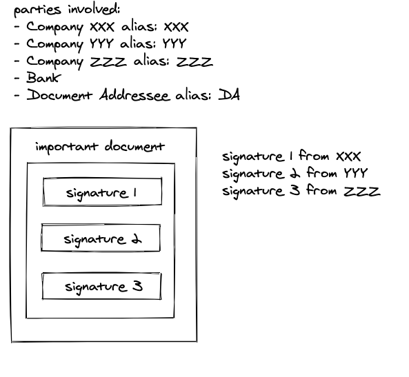
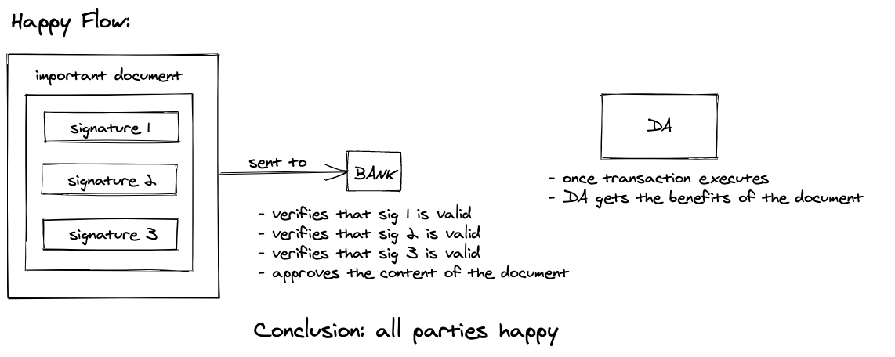
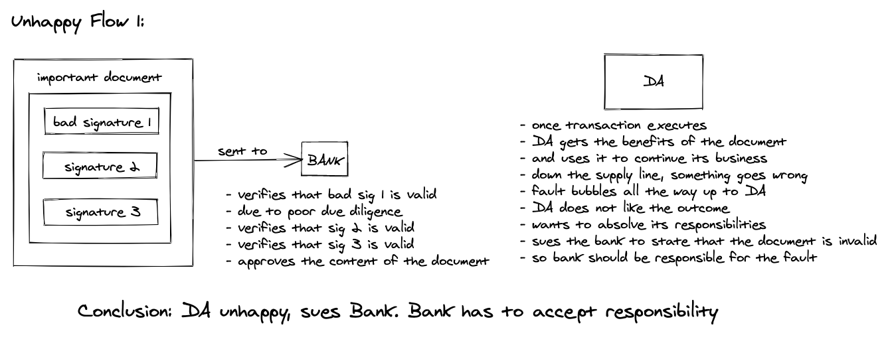
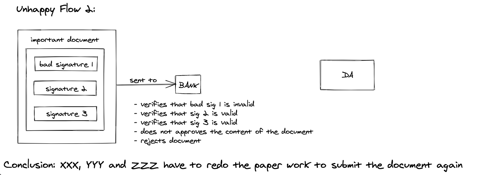
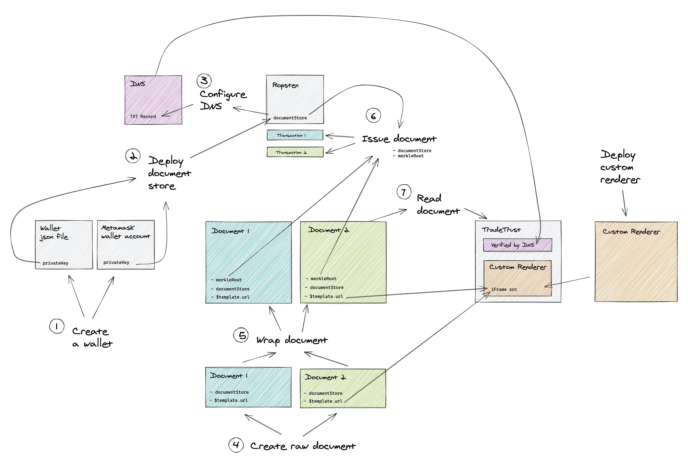
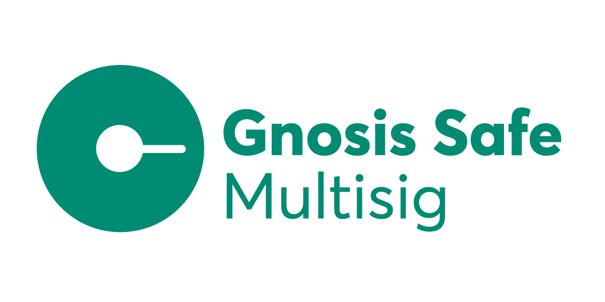
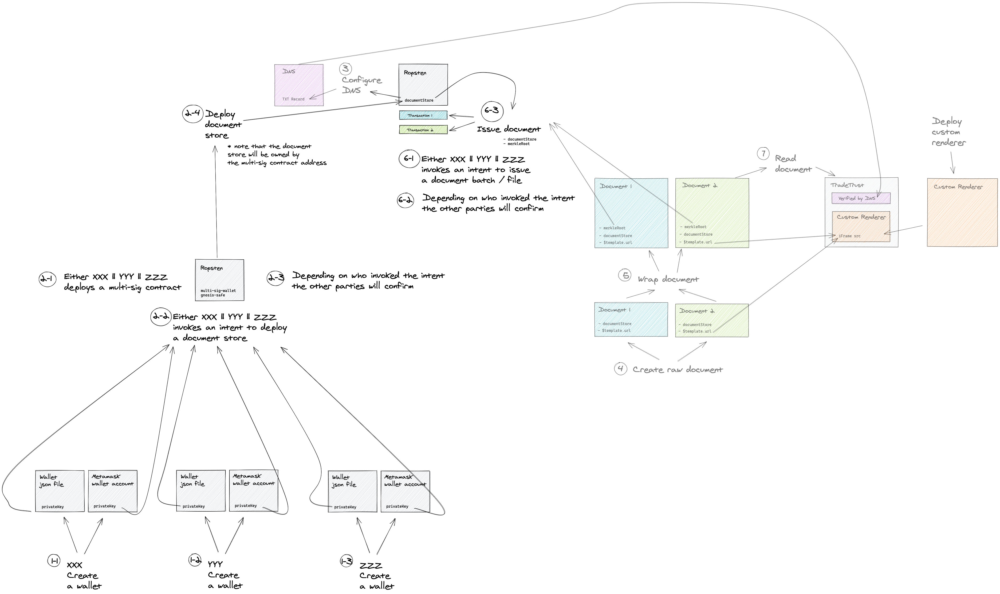

# Problem statement:
- very important document that requires 2 or more parties to authorise
- parties will sign document
- document is sent to bank

-----------------

{ height=65% }

------------------

## Happy flow:
- bank verifies that all signatures from the participating parties are valid
- proceeds on with the transaction
- party at the end of the transaction benefits and is happy. 
- All parties are happy

------------------

------------------

## Unhappy flow 1(pls correct me on this):
- somehow bank does not do its due diligence and still proceeds on with transaction
- transaction has caused a problem and the party who received the bad circumstances due to the transaction wants to sue the bank
- since bank did not do their due diligence, thus bank is responsible

------------------

------------------

## Unhappy flow 2:
- bank notes that one of the parties’s signatures is suspicious
- does not proceed with transaction
- transaction is discarded

------------------

------------------

- how can we leverage on etheruem and multi-sig wallets such that we can discard unhappy flow 1 and 2?
- put in a another way, could we prevent unhappy flow 1 and 2 from ever happening?

# State of current verification of a verifiable document:
{ height=65% }

::: notes

- will attempt to explain the flow for an individual wallet owning a document store
- good refresher for everyone here 
- for the newbies good to check whether the mental model is correct
1) individual creates an externally-owned account (pte/pub key pair) from the wallet services (oa-cli or metamask)
2) individual uses TT admin page or oa-cli to deploy a document store (individual owns the document store and is responsible for it)
 - under the hood, oa-cli invokes the doc-store factory contract to create a new instance of a doc-store
3) individual purchases a domain and maps the domain-txt record to the document store
4+5) create / wrap document with either oa-cli or doc-creator on TT website
6) individual invokes a transaction to the deployed doc-store to call the function issue with the payload of the merkel root of the wrapped documents
7) verify document on TT website

:::

# Multisig wallets:
- misnomer, actually not a wallet but a **smart contract** in the blockchain (non-custodian wallet)
- essentially a contract that acts as a **staging area** to the other smart contract (document store)
- allows more than 1 party to authorise a transaction
- multiple implementations, each with pros and cons:
    - simple-multi-sig 
    - GnosisSafe

# simple-multi-sig:
- https://github.com/christianlundkvist/simple-multisig
- minimalistic implementation of a multi-sig wallet
- idea here is to keep surface of attack of the smart contract small
- so features such as spending limits / updating who can sign are not present
- live implementation of a simple-multi-sig [factory](https://swarm-gateways.net/bzz:/multisig.3esmit.eth/)

------------------

## Pros:
- only function it exposes is an execute function
- execute function only invokes after it gathers all signatures from all parties
    - how the signatures are gathered is not the concern of this contract
- no features so the cost of deploying should be cheap
- formally verified and [audited](https://github.com/christianlundkvist/simple-multisig/blob/master/audit.pdf)

------------------

## Cons:
- `pragma solidity >=0.4.24;` (probably a major dealbreaker)
- does not seem to be maintained for quite some time
- no features :(
- quite a bit of work is needed to be done to make it user-friendly

# GnosisSafe:
- https://gnosis-safe.io/
- fully fledged solution for multi-sig (batteries included)

------------------

## Pros:
- quite feature-full (can go to the gnosis safe website to look at the features)
- everyone pays a bit of the transaction 
- good ecosystem for developers to deploy confidently
- formally verified and [audited](https://docs.gnosis.io/safe/docs/intro_audits/)
- excellent user interface and user experience

------------------

## Cons:
- too many features so cost of deploying is [high](https://help.gnosis-safe.io/en/articles/4290276-how-much-does-it-cost-to-create-a-gnosis-safe)
- too many features so surface of attack is large
- want a banana, but get the gorilla and tropical island that comes with it (paying for things that one does not need)

# how multi-sig will solve the problem defined:
{ height=65% }

::: notes

- new flow with blockchain:
    - parties get together to make a multi-sig contract
    - in order to deploy the document store, they will utilise the multi-sig contract as a staging area
    - once the document store is created, the document store address is noted by all parties
    - one of the party members wants to issue a document
    - it initialises an intent to issue a document.
    - the intent to issue a document is broadcast to all respective parties
    - the intent to issue a document will be pending until all party members approve (via interaction with the blockchain)
    - once all party members approve then transaction will go through
    - in our context, a verifiable document will be issued by a document store.
    - bank can verify that the issued document has been signed by all relevant parties by inspecting etherscan.io / TT website
    - unhappy flow 1 and 2 will never happen in this setup in this case

:::

# Conclusion:

::: incremental

- who creates the multi-sig contract? 
    - 1 party who will do the initial setup, adding allowed owners etc
- who maintains the multi-sig contract? 
    - parties involved in the authorisation
- who pays for a multi-sig transaction? 
    - depending on implementation 
    - if simple-multi-sig then the last party pays for the entire transaction (the signatures are gathered off-chain)
    - if gnosis-safe then each party pays for the gas for the approval of the transaction then the party who initiates the transaction will pay for the execution

:::

------------------

::: incremental

- can i change parties who own the multi-sig contract?
    - yes if using the gnosis-safe implementation
    - no if using simple-multi-sig
- who owns the DNS for this multi-owned document store?
    - who configures it?
- should our team provide a quick way to deploy and set up a multi-sig contract (most probably no)
    - seems like the hype for multi-sig contracts have been impacted by the hacking of [Parity multi-sig wallets](https://blog.openzeppelin.com/on-the-parity-wallet-multisig-hack-405a8c12e8f7/)
- how should our team advice companies who want to implement a multi-sig wallet?
    - look through this write up
    - engage our team to be deployed to setup a GnosisSafe (some kind of secondment)
- opportunities for reuse for multi-sig contracts?
    - yes if using the gnosis-safe implementation
    - no if using simple-multi-sig

:::
# Further actions:
1) do a poc for a simple-multi-sig contract
2) do a poc for GnosisSafe
3) explore other multi-sig contract options

# References:
- https://channel9.msdn.com/Shows/Blocktalk/Introduction-to-Multi-Signature-Wallets
- https://medium.com/@ChrisLundkvist/exploring-simpler-ethereum-multisig-contracts-b71020c19037
- https://docs.opencerts.io/v1/issuing_multisig_certificate.html
- https://www.reddit.com/r/ethdev/comments/8le4tn/executing_functions_on_other_contracts_with/

::: notes

- to compile this document into beamer slides setup your system to use [pandoc](https://pandoc.org/index.html)
- then invoke the command `pandoc -t beamer <location-of-markdown> -o <location-of-output>`

:::
