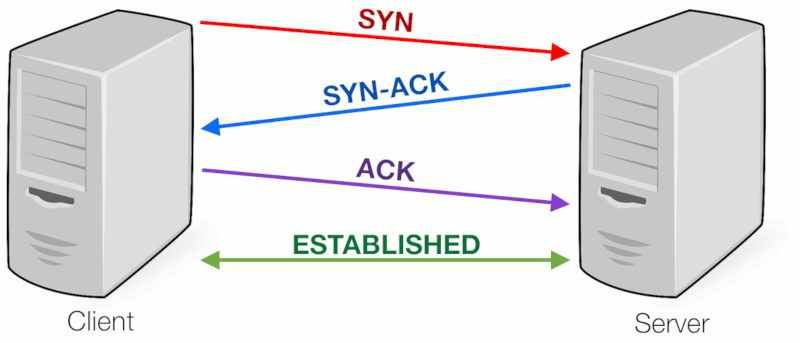

# Offline Verifier

## Problem

Currently, after a document has been issued in the Document Creator, the user has to download the file before clicking the Verify Documents tab and uploading the document for verification which may be cumbersome. Created documents can be easily accessed through their `links.self.href` attribute only because the Document creator uses this function to upload the document to a server:

```js
export const uploadToStorage = async (
  doc: WrappedDocument,
  documentStorage: DocumentStorage
): Promise<AxiosResponse> => {
  const qrCodeObj = decodeQrCode(doc.rawDocument.links.self.href);
  const uri = qrCodeObj.payload.uri;

  return axios({
    method: "post",
    url: uri,
    headers: getHeaders(documentStorage),
    data: {
      document: doc.wrappedDocument,
    },
  });
};
```
However, as the user may not have consented to an upload, this poses a problem in our current workflow. The current implementation of easy verification of a document can be found in the [gallery](https://gallery.openattestation.com/).

## Goal

To explore the option of opening a document without uploading it to a server. This will save the step of downloading, opening another window and uploading the document. Possible usecases include: Allowing a user to view a .tt document with .tt files as attachments easily in another tab. 

## Proposed Solution

We can use the postMessage method to conduct parent and child communication. To detect the message sent, an eventListener can be added in the DropZone. For example:

```js
  window.addEventListener(
    "message",
    (event) => {
      if (event.data.document) {
        updateCertificate(event.data.document);
      }
    },
    false
  );

```

In order for the parent to communicate with its child window, a reference can be saved to the return value of `window.open()`. For example:

```js
  const childWin = window.open(url, "_blank");
```

Once the reference is made, we will establish a 3-way handshake to ensure that messages can be sent from parent to child and child to parent. This is to 
ensure that a connection is established and both parties synchronize (SYN) and acknowledge (ACK) each other. Here is a simple illustration of how it is done:



When the child window is ready, it will send a SYN message to the parent through:

```js
window.opener.postMessage({ messageType: "SYN" });
```

When the parent receives the SYN message, he will send out a SYNACK message to its child:

```js
if (event.data.messageType == "SYN") {
  childWin.postMessage({ messageType: "SYNACK" });
}
```

When the child receives the SYNACK message, he will send out an ACK message back to its parent:

```js
if (event.data.messageType == "SYNACK") {
  window.opener.postMessage({ messageType: "ACK" });
}
```

Now, a connection has been established and the parent can send the document over to the child window: 

```js
if (event.data.messageType == "ACK") {
  childWin.postMessage({ messageType: "DOC", document: MY_JSON_FILE });
}
```

The child window will now be able to retrieve the document and upload it to the dropzone for it to be verified:

```js
if (event.data.messageType == "DOC") {
  const doc = event.data.document;
  updateCertificate(doc);
}
```

## Alternative Solution

Other methods we considered were:

1. LocalStorage method

We could store the document data on the user's local storage and upon clicking the Verify Document tab, load the data into the verifier before clearing it. However, this method is not recommended as there is no data protection, creating a security risk. There is also a ~5MB data limit which may be too low to store document data. Objects cannot be stored as well and must be stringified.

2. Broadcast Channel API

We could create a channel to allow a child window to subscribe to, enabling it to receive messages from its parent. More information about the implementation can be found [here](https://dev.to/dcodeyt/send-data-between-tabs-with-javascript-2oa). This method is better than listening to changes on the local storage as it is more secure and full objects can be posted. However, as of November 2020, this method is not supported by Safari, IE and Edge.