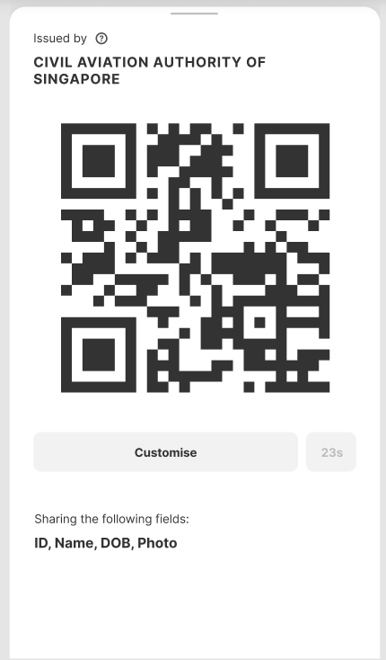

# UI Metadata

> How might we allow users to protect their own data easily using the selective disclosure function?

## Status

Draft

## Rationale

The ability to obfuscate any given key-value pair in the OA document gives users too many choices. With hundreds of keys, in machine readable format, it is hard for users to determine what subset of the data should be shared. This may often push users to take the path of least resistance to share the entire document.

Existing approach is to allow template creator to implement obfuscation within their decentralised document renderer. This has a few problem:

- Almost no document renderer in the wild implements any form of obfuscation
- Users are not able to choose a 'commonly used' subset of data, they often have to remove each field individually. Ie. Removal of transcript data in a cretificate

## Proposed Solution

The solution is to implement ui metadata at the root level of the OA document. The reason to implement this at the root level is so that users can add the ui metadata after the document has been issued. The metadata will provide information on:

1. Human-readable names to the key. Ie "dob" -> "Date of Birth"
2. Commonly used profiles. Ie "Certificate only", "Without NRIC", etc

Sample UI metadata:

```json
{
  "schema": "openattestation/v1.0",
  "data": "<OA-DOCUMENT-DATA>",
  "signature": "<OA-SIGNATURE-OBJ>",
  "ui": {
    "labels": {
      "id": "License Number",
      "name": "License Name",
      "issuanceDate": "Date of Issue",
      "recipient.name": "Name",
      "recipient.nric": "NRIC",
      "recipient.dob": "Date of Birth",
      "recipient.photo": "Photograph",
      "ratings": "Ratings"
    },
    "profiles": [
      {
        "name": "w/o Personal Information",
        "exclusions": ["recipient.nric", "recipient.dob"]
      }
    ]
  }
}
```

## Sample Usage



With the above metadata, client applications, such as a OA Identity Wallet will be able to show to users:

- What fields they are sharing with others, in a human readable format
- Selection of fields that they can choose to include/exclude
