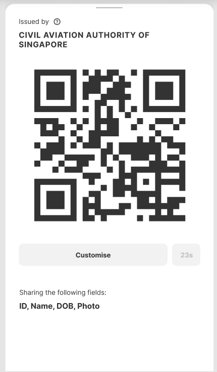

# UI Metadata

## Status

Draft

## Rationale

Currently, it is very hard for machines to display data from the OpenAttestation (OA) document if it has never negotiated a contract with the issuer, other than simply displaying the entire document through the Decentralised Renderer (DR).

This limit how other clients can interact with a OA document without the building it into the DR. For instance, if I've a mobile client to allow me to select a set of fields to hide, the client can only show the path of the key (ie. `recipient.name`) instead of what it means to user (ie. `Name of recipient`).

## Proposed approach

The proposed approach is to add metadata to tag different fields in the document for difference purposes such as:

- human-readable label to the key
- logical grouping (and the name) of a sub-tree of the data (ie `transcript`)
- user-defined profiles containing subset of data that are commonly used

The tag will be outside of the `data` field that is being signed. This allows both the issuer of the document and anyone downstream who received the document to modify the tagging of the document data.

A sample of the data will look like the following:

```json
{
  "data": {
    "id": "SALT:degree-1023",
    "recipeint": {
      "name": "SALT:Someone's name",
      "dob": "SALT:11 Nov 2011"
    },
    "transcript": [
      {
        "foo": "bar"
      }
    ]
  },
  "metadata": {
    "dataTag": {
      "recipient.name": "Name",
      "recipient.dob": "Date of Birth",
      "transcript": "Transcript Data",
      "id": "Serial No",
      "issuedOn": "Issued Date",
      "admissionDate": "Admission Date"
    },
    "profiles": [
      {
        "name": "Degree Certificate Only",
        "fields": [
          "id",
          "name",
          "issuedOn",
          "admissionDate",
          "$template",
          "issuers",
          "recipient",
          "additonalData.certSignatories"
        ]
      }
    ]
  }
}
```

## Sample Usage



With the above metadata, client applications, such as a OA Identity Wallet will be able to show to users:

- What fields they are sharing with others, in a human readable format
- Selection of fields that they can choose to include/exclude
