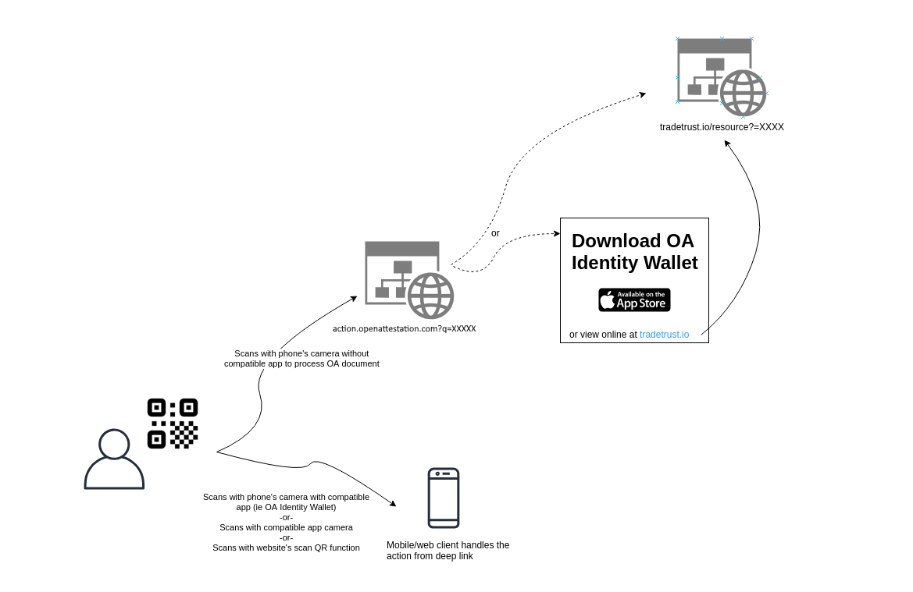

# Universal Actions for Open-Attestation Documents

## Status

Draft

## Rationale

The goal of the universal action method is to ensure that a standard is available to all clients interacting with OA documents. This allows different clients to be interoperable with one another. The standard is extremely important if we want to provide a client like an [identity wallet](https://github.com/Open-Attestation/identity-wallet) that supports all kinds of OA document.

## Universal Action

The standard will provide a way for actions to be communicated to various client implementations that uses OA documents. In addition, these actions can be scanned directly using a phone's QR code scanner to process the document.

An example of such action is when storing a OA document into a identity wallet mobile application. The user will be able to launch the identity wallet app and view the OA document by just scanning a QR code.

To do so, each of these actions will be URI formatted with a standard URL `action.openattestation.com?q=` followed by the action.

## Proposed Solution

Sample QR code:


```
https://action.openattestation.com?q=%7B%22type%22:%22DOCUMENT%22,%22payload%22:%7B%22uri%22:%22https://somehostedresources.com/doc/7de3bce4-de62-4628-914e-97d41e642582%22,%22key%22:%22aa57eb519fd3c63c42c2f2697e8957198b56fc945c4db18b480c07d2e6485a93%22,%22permittedAction%22:%5B%22STORE%22%5D,%22redirect%22:%22https://tradetrust.io/%22%7D%7D
```

Decoded Resource (after `/?q=`):

```json
{
  "type": "DOCUMENT",
  "payload": {
    "uri": "https://somehostedresources.com/doc/7de3bce4-de62-4628-914e-97d41e642582",
    "key": "aa57eb519fd3c63c42c2f2697e8957198b56fc945c4db18b480c07d2e6485a93",
    "permittedActions": ["STORE"],
    "redirect": "https://tradetrust.io/"
  }
}
```

The proposed solution is to use universal/deep links to address the namespace portion. This allow us to :

1. Provide an application (think universal router) at action.openattestation.com to handle the action if the user scans the code using a standard QR code scanner on mobile and redirect to a specific client, represented in `redirect`. --or-- Link to a page to get user to download the standard wallet app, with option to redirect to the web client if they click on that.
2. Allow any web client (tradetrust.io or opencerts.io) to scan and process the message at the provided url for redirection. The message will be available through the `q` query parameter `<redirected url>?q=<encoded-json>`. The hostname of the provided URL must have been whitelisted by action.openattestation.com.
3. Provide [deep linking](https://docs.expo.io/versions/latest/workflow/linking/) opportunities for iOS/Android app to open the correct application on the phone to process the action.

## Transfer Action

Important considerations of the transfer method:

- Reference to resource (uri)
- Encrypted resource (key)
- Permitted actions (termsOfUse)
- Safe transfer (encoding)
- Universal resolver (deep-linking)

### User Flow



#### Note on deliberately bad UX to deter fake QR codes

One method previously brought up to prevent fake websites by using QR code that does not link to a website (ie tradetrust:// instead of https://) does not work when the user faces the QR code the first time. The user will not know that they are not supposed to be brought to a website directly (with the tradetrust:// link). When a fake document with a fake QR code (ie https://tradetrust.fakewebsite.io) presents itself, the user will still be brought there.

Deliberatly bad UX in the correct flow does not prevent fake QR codes frome existing. The difference is in educating the user to recognise the right websites/tools to verify documents. For that reason, the preference is to have a better user experience when they scan a valid QR code to make use of the deeplink/redirect model.

### Considerations in this implementation

1. The decryption key is now in the path instead of appearing after `#`. If the connection is not secure, the key might be leaked to mitm.
2. W3C Verifiable Claim's presentation model might be better to represent intent. However, for this implementation we are not doing that because of the following reasons:

- The `termsOfUse` model is not well defined yet
- We do not have a "wallet" for the credential presenter to sign on the `presentation` object ([ref](https://w3c.github.io/vc-data-model/#concrete-lifecycle-example))

## Review on Current State

Currently there is no universal standard for handling transfer of OA documents. There exist two main methods of transferring now:

- QR code
- Link

### QR Code

There is two implementation currently:

#### TradeTrust

[Implementation](https://github.com/TradeTrust/tradetrust-website/pull/10/files#diff-6d8cff40428270293e71b7af0315418dL11)

TradeTrust's implementation currently use it's own namespace for the QR code and specifies a URL endpoint using `uri`. It was designed with the intention that it can be extended to transmit decryption key as well if the resource is encrypted.

Sample QR code:

```
tradetrust://%7B%22uri%22%3A%22https%3A%2F%2Fgist.githubusercontent.com%2Fyehjxraymond%2Fbf5c84f95b3e847fdae4c6935292c434%2Fraw%2F9c3cdd9221641cce1f639c99b55c83195da07482%2Ftt.json%22%7D
```

The content right after the `tradetrust://` is a json object that is url encoded.

Content:

```json
{
  "uri": "https://gist.githubusercontent.com/yehjxraymond/bf5c84f95b3e847fdae4c6935292c434/raw/9c3cdd9221641cce1f639c99b55c83195da07482/tt.json"
}
```

#### Workpass Mobile App

[Implementation](https://github.com/sgworkpass/mobile/blob/master/src/services/qrHandler/qrHandler.test.tsx)

Workpass's implementation does not have namespace. Instead, it states upfront the action permitted for the receiving party, similar to the `termOfUse` model in [W3C Verifiable Claim data model](https://w3c.github.io/vc-data-model/#terms-of-use). It also has potential to include decryption key for encrypted resources.

Sample QR Code:

```
VIEW;{"uri":"https://something.com/get/resourceId","type":"type","key":"key"}
```

### Opencerts

There is one implementation currently in OpenCerts website:

[Implementation](https://github.com/OpenCerts/opencerts-website/pull/480)

Sample URL:

```
https://dev.opencerts.io/?q=%7B%22type%22:%22DOCUMENT%22,%22payload%22:%7B%22uri%22:%22https://api.myjson.com/bins/1a9acm%22,%22key%22:%221b8c334a38f9ff96108303a4ba0cc592f1559eb24f5b48b70c9300c60a34d5e9%22,%22permittedActions%22:%5B%22STORE%22%5D,%22redirect%22:%22https://dev.opencerts.io%22%7D%7D
```
