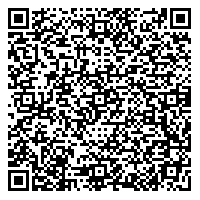

# Universal Transfer Method for Open-Attestation Documents

## Status

Draft

## Rationale

The goal of the universal transfer method is to ensure that a standard is available to all clients interacting with OA documents. This allows different clients to be interoperable with one another. The standard is extremely important if we want to provide a client like an [identity wallet](https://github.com/Open-Attestation/identity-wallet) that supports all kinds of OA document.

Important considerations of the transfer method:

- Reference to resource (uri)
- Encrypted resource (key)
- Permitted actions (termsOfUse)
- Safe transfer (encoding)
- Universal resolver (deep-linking)

## Proposed Solution

Sample QR code:



```
https://openattestation.com/?resource=%7B%22uri%22%3A%22https%3A%2F%2Fsomehostedresources.com%2Fdoc%2F7de3bce4-de62-4628-914e-97d41e642582%22%2C%22enc%22%3A%7B%22type%22%3A%22OPEN-ATTESTATION-TYPE-1%22%2C%22key%22%3A%22aa57eb519fd3c63c42c2f2697e8957198b56fc945c4db18b480c07d2e6485a93%22%7D%2C%22permittedAction%22%3A%5B%22VIEW%22%2C%22STORE%22%5D%7D
```

Decoded Resource (after `?resource=`):

```json
{
  "uri": "https://somehostedresources.com/doc/7de3bce4-de62-4628-914e-97d41e642582",
  "enc": {
    "type": "OPEN-ATTESTATION-TYPE-1",
    "key": "aa57eb519fd3c63c42c2f2697e8957198b56fc945c4db18b480c07d2e6485a93"
  },
  "permittedAction": ["VIEW", "STORE"],
  "redirect": "https://tradetrust.io/"
}
```

The proposed solution is to use universal/deep links to address the namespace portion. This allow us to :

1. Provide an application (think universal router) at openattestation.com to handle the action if the user scans the code using a standard QR code scanner on mobile and redirect to a specific client, represented in `redirect`.
2. Allow any web client (tradetrust.io or opencerts.io) to scan and process the message at the path `/resource?=<encoded-json>`
3. Provide [deep linking](https://docs.expo.io/versions/latest/workflow/linking/) opportunities for iOS/Android app to open the correct application on the phone to process the action.

### Considerations

1. The decryption key is now in the path instead of appearing after `#`. If the connection is not secure, the key might be leaked to mitm. 

## Review on Current State

Currently there is no universal standard for handling transfer of OA documents. There exist two main methods of transferring now:

- QR code
- Link

### QR Code

There is two implementation currently:

#### TradeTrust

[Implementation](https://github.com/TradeTrust/tradetrust-website/pull/10/files#diff-6d8cff40428270293e71b7af0315418dL11)

TradeTrust's implementation currently use it's own namespace for the QR code and specifies a URL endpoint using `uri`. It was designed with the intention that it can be extended to transmit decryption key as well if the resource is encrypted.

Sample QR code:

```
tradetrust://%7B%22uri%22%3A%22https%3A%2F%2Fgist.githubusercontent.com%2Fyehjxraymond%2Fbf5c84f95b3e847fdae4c6935292c434%2Fraw%2F9c3cdd9221641cce1f639c99b55c83195da07482%2Ftt.json%22%7D
```

The content right after the `tradetrust://` is a json object that is url encoded.

Content:

```json
{
  "uri": "https://gist.githubusercontent.com/yehjxraymond/bf5c84f95b3e847fdae4c6935292c434/raw/9c3cdd9221641cce1f639c99b55c83195da07482/tt.json"
}
```

#### Workpass Mobile App

[Implementation](https://github.com/sgworkpass/mobile/blob/master/src/services/qrHandler/qrHandler.test.tsx)

Workpass's implementation does not have namespace. Instead, it states upfront the action permitted for the receiving party, similar to the `termOfUse` model in [W3C Verifiable Claim data model](https://w3c.github.io/vc-data-model/#terms-of-use). It also has potential to include decryption key for encrypted resources.

Sample QR Code:

```
VIEW;{"uri":"https://something.com/get/resourceId","type":"type","key":"key"}
```

### Direct Link

There is one implementation currently in OpenCerts website:

[Implementation](https://github.com/OpenCerts/opencerts-website/pull/399)

The OpenCerts method allows the user to provide just the resource id.

Sample URL:

```
https://opencerts.io/?documentId=7de3bce4-de62-4628-914e-97d41e642582#aa57eb519fd3c63c42c2f2697e8957198b56fc945c4db18b480c07d2e6485a93
```

The url has two parts. The first is the `documentId` which resolves to a URI when combined with the base endpoint URL. The second is the `decryptionKey` which appears after the `#`. The decryption key is used to decrypt the document after it has been downloaded from the URI to return the original document in clear text.
