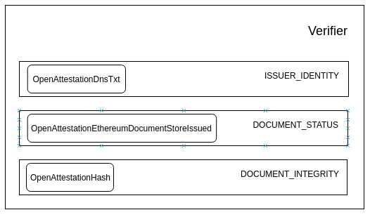

# OpenAttestation Verifier

## Status

[Draft](https://github.com/Open-Attestation/oa-verify/pull/74)

## Goal

The purpose of the verifier is to provide a generic verification method to verify OpenAttestation(OA) documents. The verifier will provide default verification methods conforming to the standard verification process proposed in OpenAttestation yet providing opportunities for it to be extended.

## Architecture



### Verification Methods

A verifier is made up of multiple `Verification Methods`. In the diagram above, `OpenAttestationDnsTxt`, `OpenAttestationEthereumDocumentStoreIssued` and `OpenAttestationHash` are examples of `Verification Methods` provided.

The role of a verification method is to verify the OA document is valid against specific criteria. Since there are many types and versions of OA document, not all test should run against all types of OA document. For that reason, a `test` method is also defined to test if a method should run against a document. If the method is incompatible with the document type, it should `skip` the method.

As a result, a verification method should implement 3 abstract methods: `verify`, `test` and `skip`.

The verification method should return a `VerificationFragment` which states the status of the verification. The `status` key can have the following values:

- `VALID`: when the verification is successful
- `INVALID`: when the verification is unsuccessful
- `ERROR`: when an unexpected error is met
- `SKIPPED`: when the verification was skipped by the manager

#### test(document: Document): boolean

This function takes in an OA document and returns a boolean result that determines if this verification method is meant to be ran against the document.

In the case that the test passes, we should run the `verify` function. Otherwise, the `skip` function should be ran.

#### skip(): VerificationFragment

This function should be ran when the verification method is skipped for the given OA document. It will return the skipped `VerificationFragment` for the test.

An example of `VerificationFragment` that skips the DNS-TXT verification:

```json
{
  "name": "OpenAttestationDnsTxt",
  "type": "ISSUER_IDENTITY",
  "status": "SKIPPED",
  "message": "Document issuers doesn't have \"documentStore\" or \"token\" property"
}
```

#### verify(document: Document): VerificationFragment

This function should be ran when the test passes. Running this function will execute the necessary computation to determine if the document passes the verification method.

An example `VerificationFragment` of a passing test:

```json
{
  "name": "OpenAttestationEthereumDocumentStoreIssued",
  "type": "DOCUMENT_STATUS",
  "status": "VALID",
  "data": {
    "details": [
      {
        "address": "0x007d40224f6562461633ccfbaffd359ebb2fc9ba",
        "issued": true
      }
    ],
    "issuedOnAll": true
  }
}
```

An example `VerificationFragment` of a failed test:

```json
{
  "name": "OpenAttestationEthereumDocumentStoreIssued",
  "type": "DOCUMENT_STATUS",
  "status": "INVALID",
  "message": "Certificate has not been issued",
  "data": {
    "details": [
      {
        "address": "0x20bc9C354A18C8178A713B9BcCFFaC2152b53990",
        "error": "call exception (address=\"0x20bc9C354A18C8178A713B9BcCFFaC2152b53990\", method=\"isIssued(bytes32)\", args=[\"0x85df2b4e905a82cf10c317df8f4b659b5cf38cc12bd5fbaffba5fc901ef0011b\"], version=4.0.40)",
        "issued": false
      }
    ],
    "issuedOnAll": false
  }
}
```

### Verification Types

A `Verification Type` is a type label to a verification method. It specifies what type of verification the method is performing. The diagram above shows the 3 default verification types: `ISSUER_IDENTITY`, `DOCUMENT_INTEGRITY` and `DOCUMENT_STATUS`.

For the validity of the verification type to be true, the requirements must be met:

1. At least one method in that type should return `VALID` as the status.
1. All methods in the type should return either `VALID` or `SKIPPED` as the status.

### Verifier

The verifier is a function used to verify any OpenAttestation document. It returns a set of `VerificationFragment` from the different verification methods.

From the `VerificationFragments` we can then determine if the OA document is valid. The OA document is valid when all `Verification Types` has valid statuses.

## Default Verification Types and Methods

### Document Integrity (DOCUMENT_INTEGRITY)

The `DOCUMENT_INTEGRITY` type of verification methods ensure that the content of the issued document has not been modified since the document has been issued, with exception of data which has been removed using built-in obfuscation mechanism.

#### OpenAttestationHash

The `OpenAttestationHash` method checks the integrity of the document using the `OpenAttestationSignature2018` method by digesting the content of the OA document and comparing it with the document's `targetHash`.

In addition, if the `targetHash` does not match the `merkleRoot` of the document, the function also checks that the `targetHash` resolves to the `merkleRoot` using the given `proofs`.

### Document Status (DOCUMENT_STATUS)

The `DOCUMENT_STATUS` type of verification methods checks that the document has been issued and that it's issuance status is in good standing. Methods of these types generally verifies the issuance status against a record maintained externally, ie Records on a Blockchain or API endpoints.

#### OpenAttestationEthereumDocumentStoreIssued

The `OpenAttestationEthereumDocumentStoreIssued` checks the issuance status of the document using `OpenAttestationSignature2018` with `DOCUMENT_STORE` or `TOKEN_REGISTRY` methods.

Signature of OA Document using this method:

```json
{
  "proof": {
    "type": "OpenAttestationSignature2018",
    "method": "DOCUMENT_STORE",
    "value": "0x9178F546D3FF57D7A6352bD61B80cCCD46199C2d"
  }
}
```

Such document uses a smart contract to store the issuance status of the document.

In the case of `DOCUMENT_STORE` smart contract, the check calls the method `isIssued(merkleRoot)` implemented on the Ethereum smart contract. It returns a valid `VerificationFragment` if the merkle root of the document has been marked as issued.

In the case of `TOKEN_REGISTRY` smart contract, the check calls the method `ownerOf(targetHash)` implemented on the Ethereum smart contract. It returns a valid `VerificationFragment` if the owner of the document is non-zero.

#### OpenAttestationEthereumDocumentStoreRevoked

The `OpenAttestationEthereumDocumentStoreRevoked` checks the revocation status of the document using `OpenAttestationSignature2018` with `DOCUMENT_STORE` or `TOKEN_REGISTRY` methods, similar to `OpenAttestationEthereumDocumentStoreIssued`.

In the case of `DOCUMENT_STORE` smart contract, the check calls the method `isRevoked(merkleRoot)` implemented on the Ethereum smart contract. It returns a valid `VerificationFragment` if the merkle root of the document has not been marked as revoked.

### Issuer Identity (ISSUER_IDENTITY)

The `ISSUER_IDENTITY` type of verification methods checks and return the identity of the issuer. Methods of these types generally verify the identity of the issuer against a decentralised identity provider (ie DID, DNS, etc) or some centrally managed identity registry (ie Singapore's OpenCerts Registry, Citizen Identity Registry, Business Identity Registry, etc).

#### OpenAttestationDnsTxt

The `OpenAttestationDnsTxt` method checks the identity of a document issuer using the `DNS-TXT` identity proof mechanism. 

The sample provided below shows a document which claims that `openattestation.com` is the owner of the smart contract `0x9178F546D3FF57D7A6352bD61B80cCCD46199C2d`, which in turn issued the said document:

```json
{
  "issuer": {
    "id": "https://openattestation.com",
    "name": "Open Attestation",
    "identityProof": {
      "type": "DNS-TXT",
      "location": "openattestation.com"
    }
  },
  "proof": {
    "type": "OpenAttestationSignature2018",
    "method": "DOCUMENT_STORE",
    "value": "0x9178F546D3FF57D7A6352bD61B80cCCD46199C2d"
  }
}
```

The method checks against the DNS record of the domain to confirm the claimed relationship. A sample TXT record on `openattestation.com` to prove ownership of the contract `0x9178F546D3FF57D7A6352bD61B80cCCD46199C2d` on Ethereum Ropsten network is provided below:

```
openatts net=ethereum netId=3 addr=0x9178F546D3FF57D7A6352bD61B80cCCD46199C2d
```

Upon confirming that the matching DNS TXT record on the domain, the verification method returns a valid `VerificationFragment` as the result.

In depth discussion of DNS-TXT method is described [in this blog post](https://blog.gds-gov.tech/opencerts-2-0-decentralised-issuer-identity-verification-fb7e2cae8295)

## Usage

To use the default verifier:

```js
const document = "OA-Document";
const verificationFragments = verify(document);
const verified = isVerified(verificationFragments);
```

To extend the verifier with a custom name registry:

```js
const document = "OA-Document-With-Custom-Identity-Proof";
const customIdentityRegistry = "Custom-Verification-Method";
const verificationFragments = verificationBuilder(document, [
  ...defaultVerifiers,
  customIdentityRegistry
]);
const verified = isVerified(verificationFragments);
```

### Todo

Write about:

- `OpenAttestationSignature2018`
